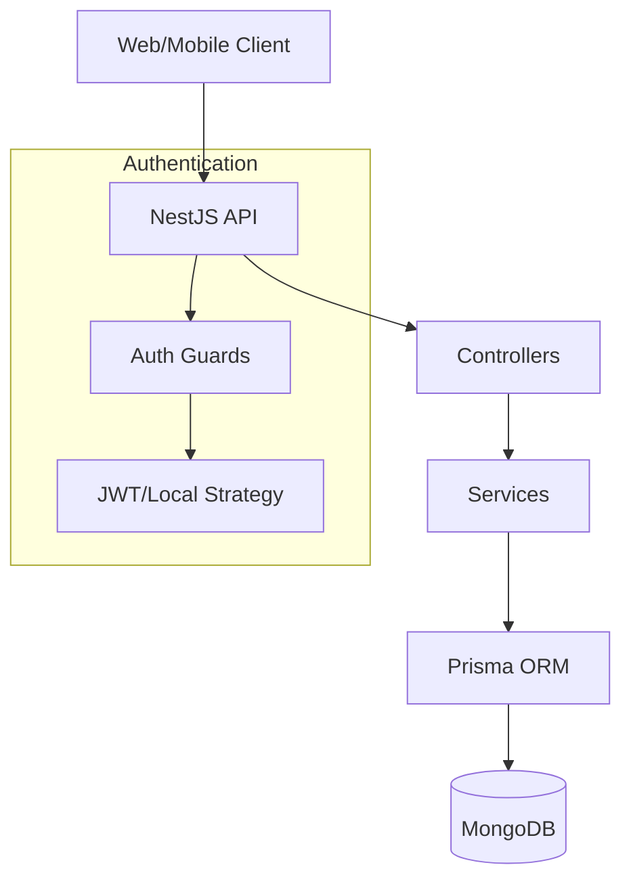
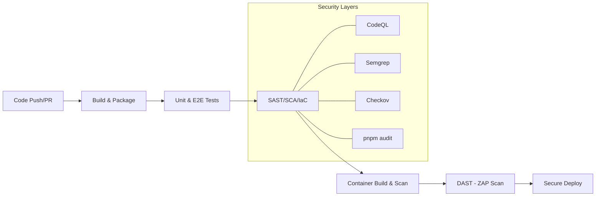

# System Architecture

This document provides a high-level overview of the Software Optimization API's architecture and its integrated DevSecOps lifecycle.

## Application Architecture

The application is built using a modern, scalable stack:

- **Core Framework**: [NestJS](https://nestjs.com/) (Node.js)
- **Language**: TypeScript
- **Database**: [MongoDB](https://www.mongodb.com/)
- **ORM**: [Prisma](https://www.prisma.io/)
- **Runtime**: Node.js 20 (Distroless for production)

### Component Diagram

## DevSecOps Pipeline Flow

The pipeline enforces a "Shift-Left" security model where every code change is validated before reaching production.

## Security Strategy

### 1. Static Analysis (SAST & SCA)
- **Semantic Code Parsing**: CodeQL (pinned to SHA) analyzes code flow for complex vulnerabilities.
- **Rule-based Scanning**: Semgrep checks for common anti-patterns.
- **Dependency Guard**: `pnpm audit` ensures production libraries are vulnerability-free.

### 2. Infrastructure & Container Security
- **IaC Scan**: Checkov validates Dockerfile best practices.
- **Image Scanning**: Trivy scans the final image for OS and library CVEs.
- **Distroless Runtime**: The production image contains zero shell or package manager binaries, significantly reducing the attack surface.

### 3. Dynamic Analysis (DAST)
- **ZAP Baseline Scan**: Automated scanning of the running API to detect missing security headers and runtime misconfigurations.

### 4. Continuous Monitoring
- **Real-time Notifications**: Job Scorecards sent to MS Teams provide immediate visibility into security and quality metrics for every run.
