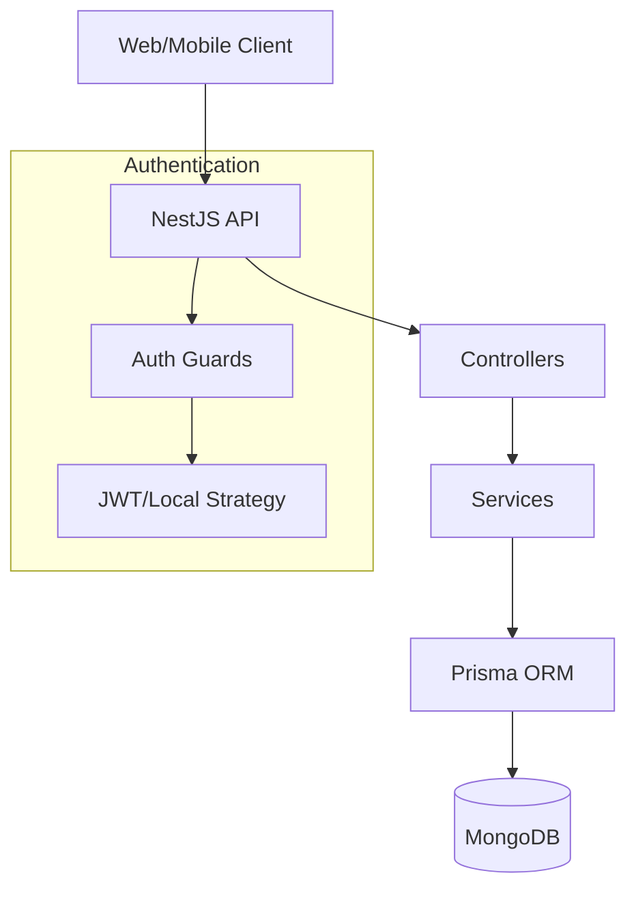
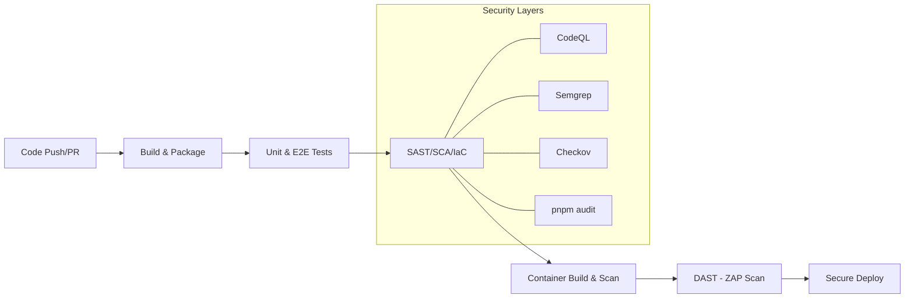

# System Architecture

This document provides a high-level overview of the Software Optimization API's architecture and its integrated DevSecOps lifecycle.

## Application Architecture

The application is built using a modern, scalable stack:

- **Core Framework**: [NestJS](https://nestjs.com/) (Node.js)
- **Language**: TypeScript
- **Database**: [MongoDB](https://www.mongodb.com/)
- **ORM**: [Prisma](https://www.prisma.io/)
- **Runtime**: Node.js 20 (Distroless for production)

### Component Diagram

## DevSecOps Pipeline Flow

The pipeline enforces a "Shift-Left" security model where every code change is validated before reaching production.

## Security Strategy & Enforcement

### 1. Static Analysis (SAST & SCA)
- **Semantic Code Parsing**: CodeQL (pinned to SHA) analyzes code flow for complex vulnerabilities like SQL injection or cross-site scripting (XSS).
- **Rule-based Scanning**: Semgrep checks for common anti-patterns using local and community rulesets.
- **Dependency Guard**: `pnpm audit` ensures production libraries are vulnerability-free.

### 2. Infrastructure & Container Security
- **IaC Scan**: Checkov validates Dockerfile best practices (e.g., non-root user, no health check instruction in favor of orchestration).
- **Image Scanning**: Trivy scans the final image for OS and library CVEs.
- **Distroless Runtime**: The production image uses `gcr.io/distroless/nodejs20-debian12`, containing zero shell or package manager binaries, significantly reducing the attack surface.

### 3. Dynamic Analysis (DAST)
- **ZAP Baseline Scan**: Automated scanning of the running API to detect missing security headers and runtime misconfigurations.
- **Rules Customization**: Managed via `zap_rules.tsv` to minimize noise.

### 1. Versioning & Tagging

- **SHA-based Tagging**: Every build is uniquely identified by its GitHub Commit SHA.
- **Latest Reference**: On every successful deployment to `main`, the artifact is also uploaded to a `latest/` directory in Artifactory, and the Docker image is tagged as `:latest`. This allows downstream consumers and CD tools to always pull the most recent stable version without manual version updates.

### 7. Deployment / Publish

- **Artifactory Upload**:
  - Uploads the packaged `.tgz` artifact to Artifactory.
  - **Hard Gate**: Only runs on pushes to `main` if **ALL** preceding jobs (Lint, Test, Secret, SAST, DAST, IaC) succeed.

### 8. Monitoring & Alerting

- **MS Teams (Adaptive Cards)**:
  - Sends a detailed **Job Scorecard** notification using the modern `Adaptive Card` format (v1.4).
  - Includes a status summary for every job in the pipeline and the final coverage score.
  - Dispatched via a Power Automate Workflow webhook.

## Data Flow Lifecycle

1. **Commit Phase**: Husky triggers `lint-staged` for local linting and spellcheck.
2. **Integration Phase**: GitHub Actions triggers the `devsecops.yml` workflow.
3. **Validation Phase**: Parallel scans (CodeQL, Semgrep, Trivy, ZAP) validate the application.
4. **Enforcement Phase**: The `ci-success` job acts as the final gate, blocking the workflow if any scan fails.
5. **Release Phase**: On every successful run on the `main` branch, the stable build artifact is published to Artifactory (tagged with both SHA and `latest`), and the production Docker image is tagged as `:latest` for easy consumption.

## Integration Environments
The pipeline leverages Docker-based services to simulate production environments during validation:

- **E2E Environment**: Spins up a `mongo:4.4` container with a configured **Replica Set** (`rs0`) to support advanced MongoDB features required by the application.
- **DAST Environment**: Uses `docker load` to run the actual application container in a `host` network, allowing the ZAP scanner to access the API at `localhost:3000` while utilizing a sidecar `mongo:latest` service.
